A Spring Boot REST API built around a coffee shop theme. Instead of a boring movie/book API I went with drinks, and gave the whole menu a cat theme because why not.

## About me

Alya Aldaka.
A caffeine-powered CY grad and cat lover who loves animals and nature, and dreams of a quiet farmhouse in Sweden, far away from technology.

Theme: Coffee Shop

A few facts about me:
- Self-proclaimed caffeine addict, cappuccino/Spanish latte is my go-to, matcha and tea when I need something lighter
- I can play the piano
- Half Bahraini, half Indonesian
- If I could, I'd adopt every cat in the world

Favorite item: Cappuccino
Currently learning: Advanced Java

## What this API does

It's a menu of drinks that you can browse, search, filter by price, add to, edit, and delete. There's also a stats endpoint, a random "surprise me" drink picker, a recommendation endpoint, and a "vibe" endpoint that tells you what a given caffeine level feels like.

## Endpoints

Base URL: `http://localhost:3000/alya`

| Method | Endpoint | What it does |
|---|---|---|
| GET | `/profile` | My developer profile — name, theme, facts, etc. |
| GET | `/drinks` | Returns the whole menu |
| GET | `/drinks/{id}` | Returns one drink by its ID |
| GET | `/drinks/search?name=` | Searches drinks by name (partial match, not case sensitive) |
| GET | `/drinks/filter?minPrice=&maxPrice=` | Filters drinks within a price range |
| POST | `/drinks` | Adds a new drink to the menu |
| PUT | `/drinks/{id}` | Updates an existing drink by ID |
| DELETE | `/drinks/{id}` | Removes a drink from the menu by ID |
| GET | `/drinks/stats` | Total drinks, average rating, average price, highest rated drink, and a breakdown by caffeine level |
| GET | `/drinks/surpriseme` | Picks a random drink from the menu |
| GET | `/drinks/recommend?caffeineLevel=&minRating=` | Recommends drinks matching a caffeine level and a minimum rating |
| GET | `/drinks/vibe?caffeineLevel=` | Tells you the "vibe" of a caffeine level (None/Low/Medium/High) and lists which drinks match it |

### Example: creating a drink

\`\`\`
POST /alya/drinks
\`\`\`
\`\`\`json
{
"name": "Peach Ice Tea",
"caffeineLevel": "Medium",
"price": 2,
"rating": 4.6
}
\`\`\`

### Example: what /drinks/vibe looks like

\`\`\`
GET /alya/drinks/vibe?caffeineLevel=High
\`\`\`
\`\`\`json
{
"caffeineLevel": "High",
"vibe": "Full send energy -- buzzing, wired, ready to conquer the day.",
"matchingDrinks": ["Purrista's Cappuccino", "Espresso Whiskers", "Iced Cat-mericano", "Cold Brew Claws"]
}
\`\`\`

## The menu

- Purrista's Cappuccino
- Meow-cha Latte
- Espresso Whiskers
- Iced Cat-mericano
- Cat Nap Chamomile
- Cold Brew Claws
- V60 with Berry Hues
- Chinese Black Tea

The app runs on port 3000. All routes are prefixed with `/alya`.

## Testing

All endpoints were tested manually in Postman — GET, POST, PUT, and DELETE requests, plus query params and path variables. Screenshots of each one working are below.

### GET `/alya/profile`
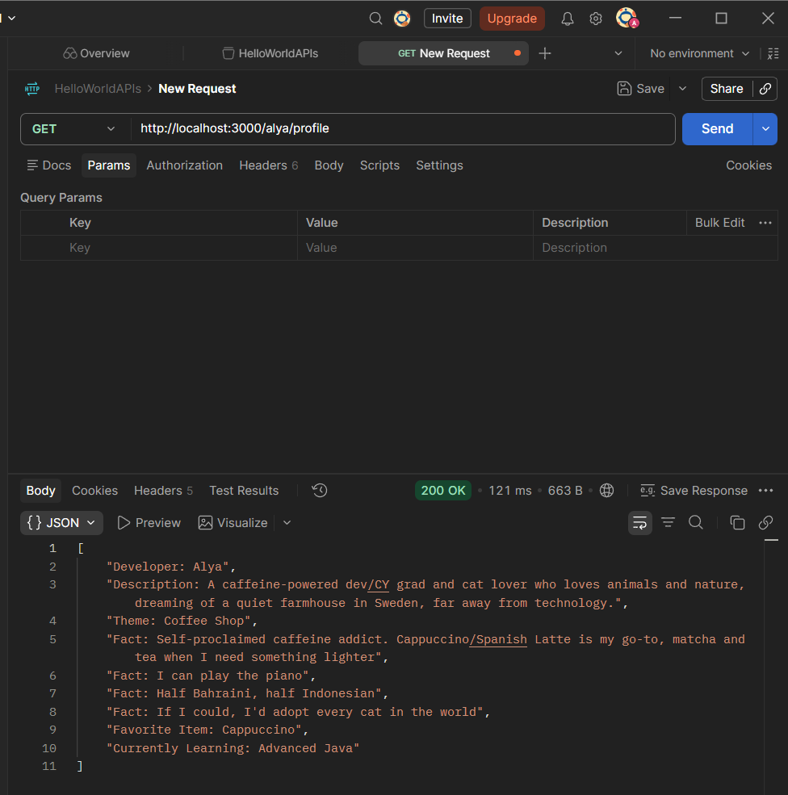

### GET `/alya/drinks`
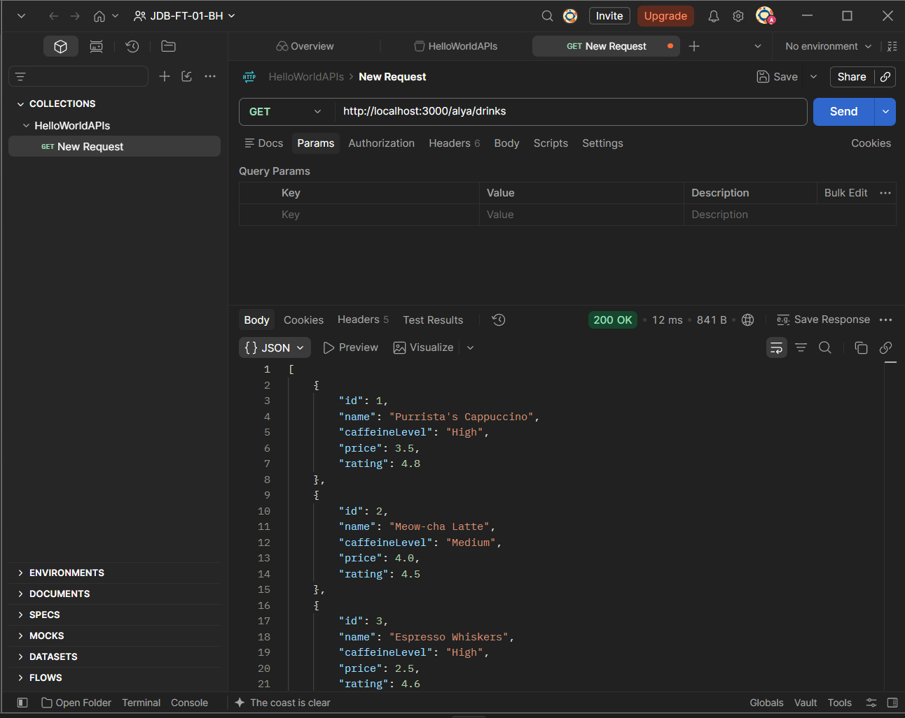

### GET `/alya/drinks/{id}`
Requesting drink ID 5.

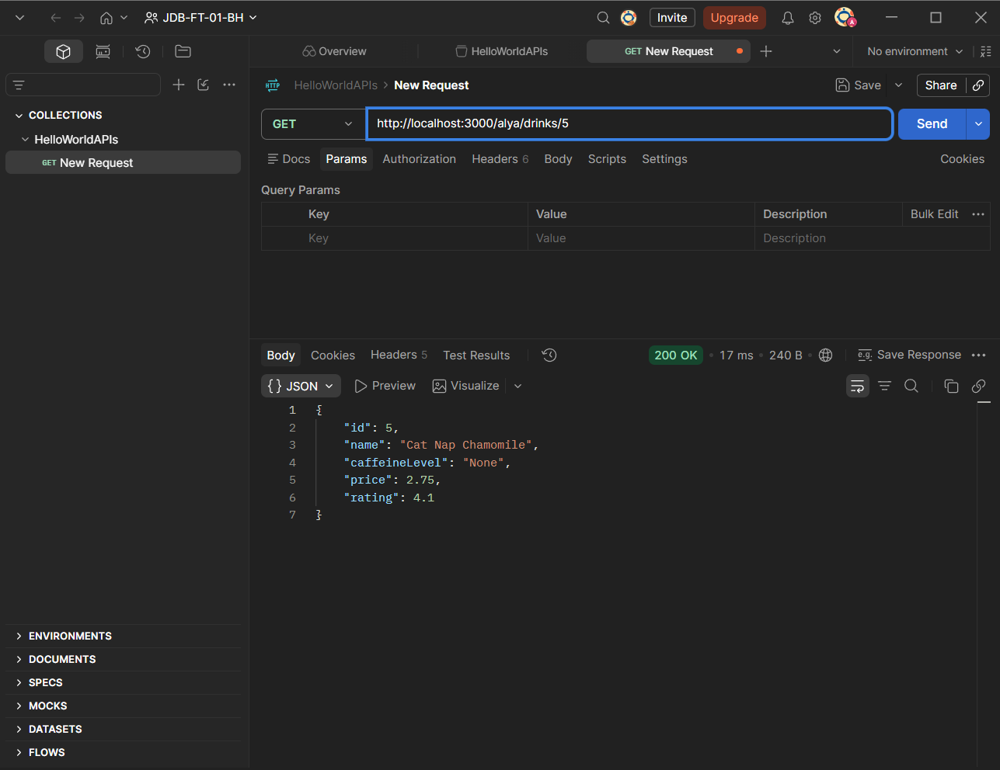

### GET `/alya/drinks/search?name=`
Searching for `meow`:

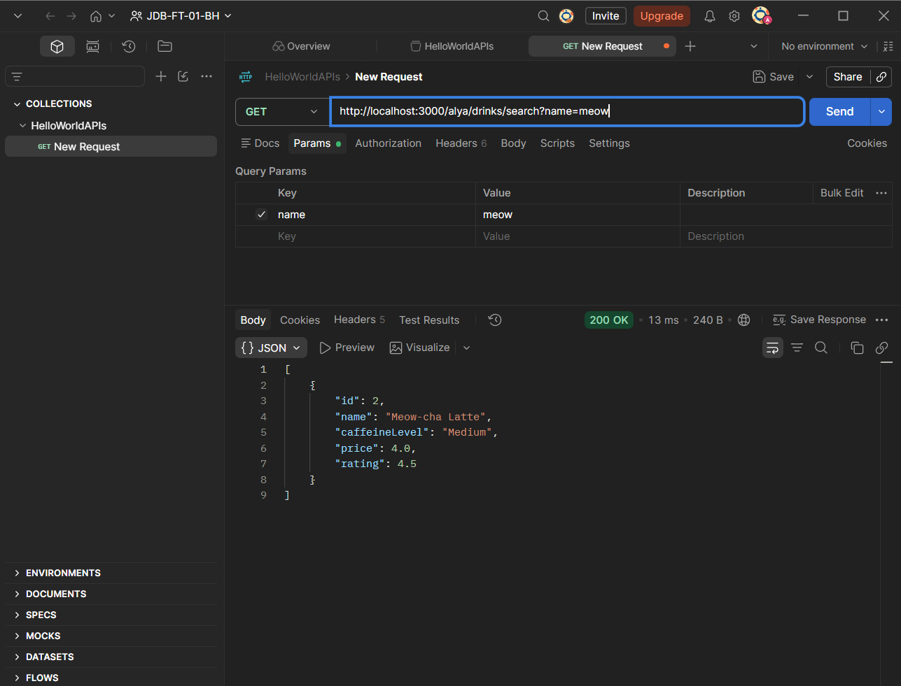

Searching for `ice` (matches the newly added Peach Ice Tea too):

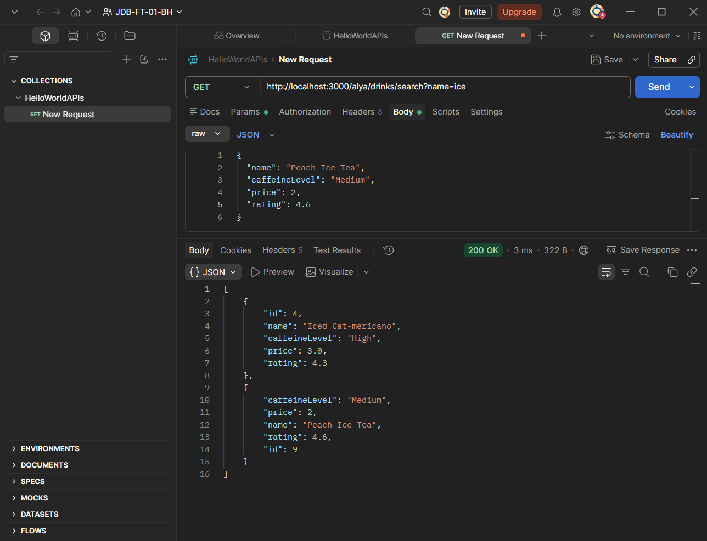

### GET `/alya/drinks/filter?minPrice=&maxPrice=`
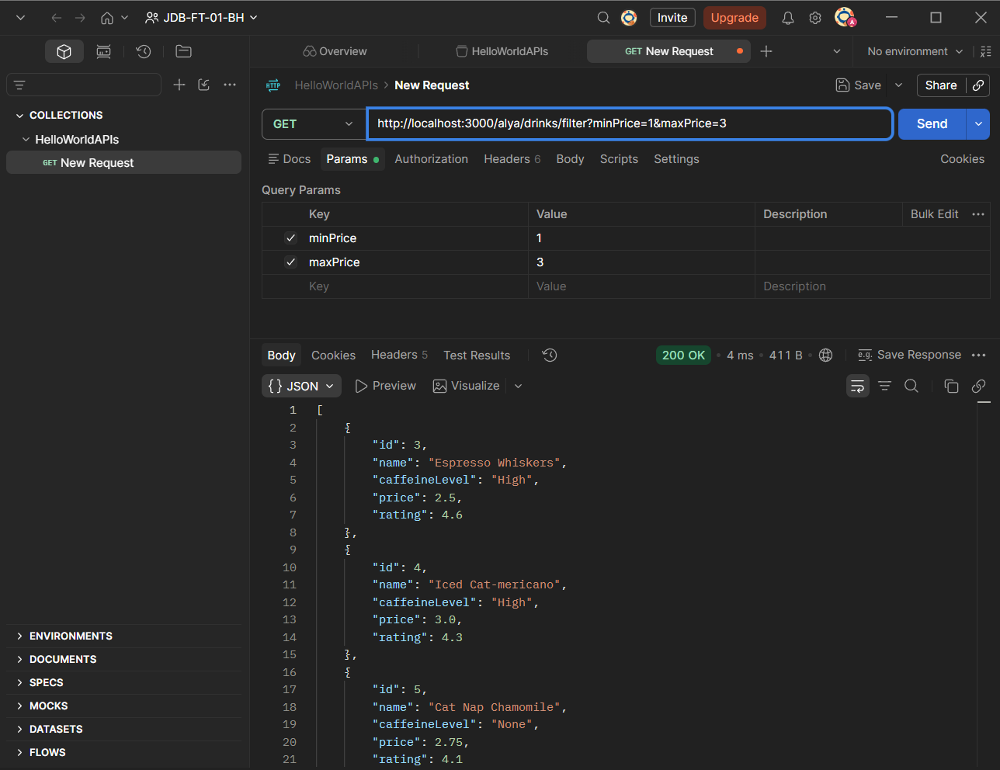

### POST `/alya/drinks`
Adding "Peach Ice Tea" — it gets assigned ID 9.

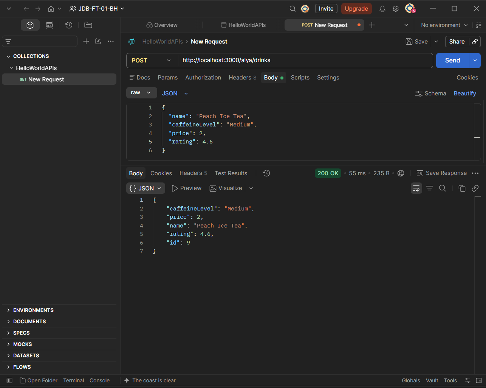

### PUT `/alya/drinks/{id}`
Updating drink 1 to "Purrista's Cappuccino Deluxe".

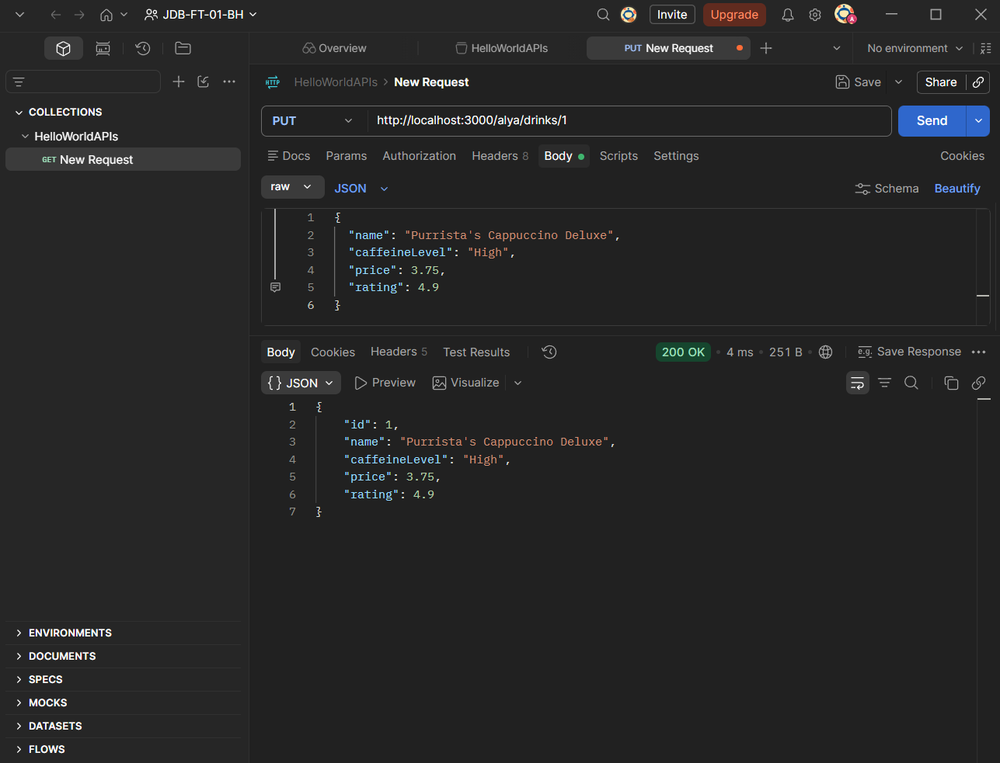

### DELETE `/alya/drinks/{id}`
Deleting drink 8.

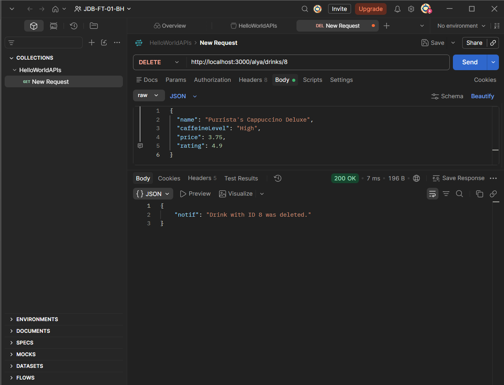

### GET `/alya/drinks/stats`
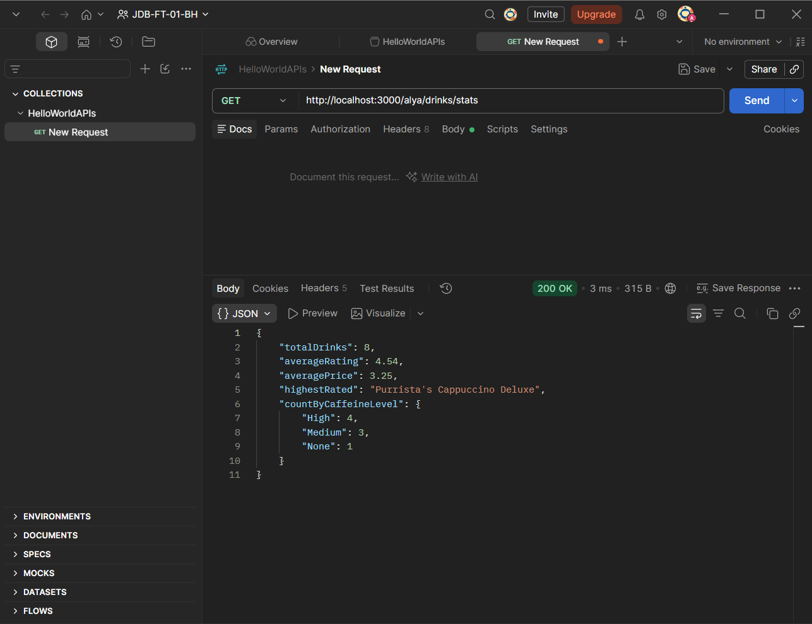

### GET `/alya/drinks/surpriseme`
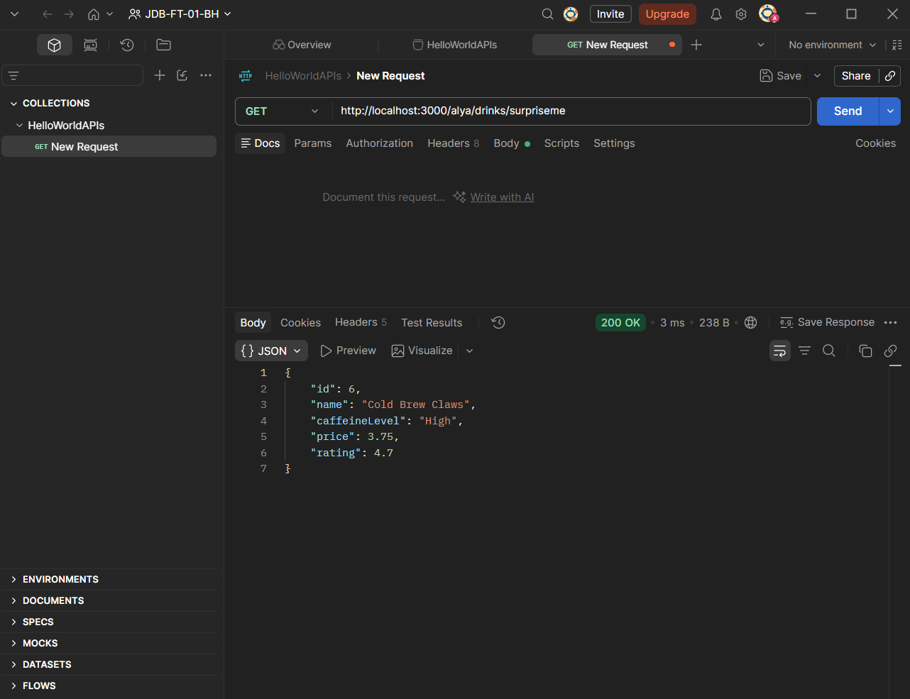

### GET `/alya/drinks/recommend?caffeineLevel=&minRating=`
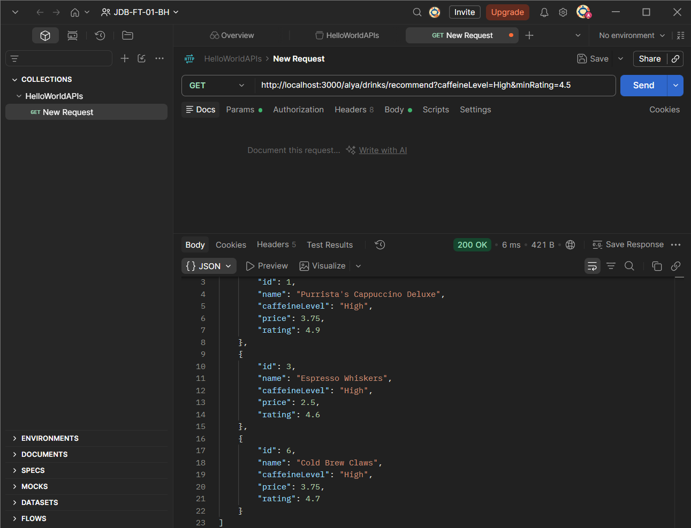

### GET `/alya/drinks/vibe?caffeineLevel=`
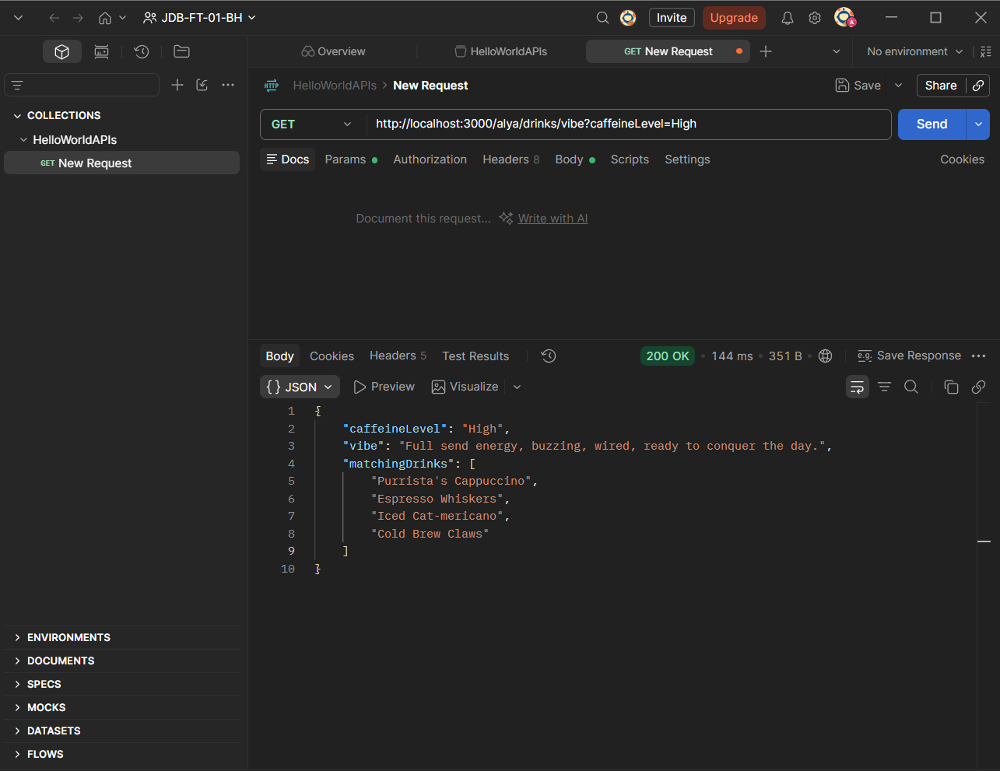